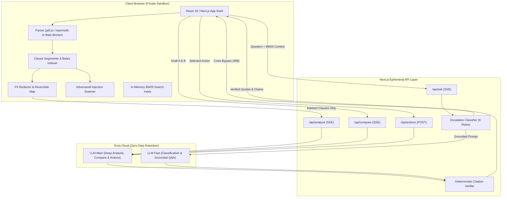

# LexLens — Know What You're Signing

> **A GenAI-powered legal document assistant that gives you a lawyer's-eye view of contracts, agreements, and policies — without pretending to be a lawyer.**

[](https://lexlens-one.vercel.app)
[](https://nextjs.org/)
[](https://react.dev/)
[](https://www.typescriptlang.org/)
[](https://groq.com/)
[](https://vitest.dev/)
[](./tests/evals)

---

## 🌐 Live Production Application

Explore the live, deployed web application:
👉 **[https://lexlens-one.vercel.app](https://lexlens-one.vercel.app)**

---

## 🏛️ Problem Statement

Legal documents are complex, opaque, and difficult to navigate without costly professional legal assistance. People routinely sign apartment leases, employment offers, consulting agreements, and SaaS terms of service without understanding the hidden obligations, unilateral indemnities, or severe liability risks embedded in them.

**LexLens** bridges this gap by making legal text accessible, transparent, and actionable through:
1. **Perspective-Aware Analysis:** Evaluates risk specifically from *your* role (e.g. Tenant vs Landlord, Employee vs Employer, Contractor vs Client).
2. **100% Verifiable Citations:** Every single claim carries a verbatim quote verified deterministically against source text. Hallucinated quotes are dropped fail-closed.
3. **Draft Comparison:** Redlines two versions of a document to surface the *changes that actually matter* to you.
4. **Actionable Preparation:** Generates printable **Lawyer Briefs**, **Action Checklists**, RFC-5545 calendar deadlines (`.ics`), and compromise negotiation clauses.
5. **Zero-Retention Privacy:** Parses documents client-side in your browser via Web Workers; redacts PII before sending; stores zero document text in databases or server logs.

---

## ✨ Key Capabilities

### 1. Reader & X-Ray Marginalia (`/workspace`)
- **Client-Side Ingestion:** Parses PDFs (`pdf.js`), Word documents (`mammoth`), and plain text without raw files leaving the browser.
- **Deterministic Clause Segmentation:** Segments contracts into addressable units with Bates stamp IDs (`C1`, `C2`, etc.).
- **Interactive Vellum Sheet:** Beautiful Chambers & Paper reading sheet accompanied by dynamic marginalia notes, risk pills, and confidence meters.
- **Real-Time Streaming:** SSE streaming analysis via Groq Cloud LLM providers.

### 2. Contract Comparison (`/compare`)
- **Word-Level Redline:** Visualizes additions and deletions side-by-side or unified using deterministic diffing.
- **Top Changes That Matter:** Flags critical shifts in liability, deadlines, and payment terms between draft versions.

### 3. Grounded Q&A
- **BM25 Lexical Indexing:** Retrieves exact relevant clauses using in-memory BM25 index.
- **Strict Grounding Contract:** Answers are categorized as `document`, `general_information`, or an honest `not_found`. Never hallucinates unanswerable questions.
- **Emergency Escalation:** Detects 9 real-world legal and crisis triggers (eviction notices, court hearings, arrest, self-harm) and displays immediate legal-aid referral banners with crisis hotline fast-paths.

### 4. Lawyer Brief & Exports (`/brief`)
- **2-Page Printable Brief:** Formatted with print stylesheets for meetings with legal counsel.
- **Calendar Integration:** Exports obligations directly to Apple/Google/Outlook Calendar via standard RFC-5545 `.ics` files.
- **Compromise Language:** Suggests balanced, counter-proposal wording for one-sided terms.

### 5. Security, Safety & Privacy
- **Client-Side PII Shield:** Masks emails, phone numbers, government IDs (SSN/Aadhaar/PAN), and payment cards with a reversible local token map before network transmission.
- **Prompt Injection Scanner:** Quarantines adversarial prompt injection patterns ("ignore previous instructions", bidi overrides, zero-width characters) and isolates them in data boundaries.
- **Zero Document Text Logged:** Server logs record only metadata (`requestId`, `latencyMs`, `clauseCount`). Document and question text are never logged.
- **Private Mode & Clear Everything:** Disables history and wipes IndexedDB and local storage with one click.

---

## 🎨 Design System: "Chambers & Paper"

LexLens is crafted with a bespoke, editorial aesthetic inspired by historic Inns of Court and legal chambers:
- **Baize Green Marble (`#0b1a13`, `#10271d`):** Rich, dignified dark mode backdrop.
- **Vellum Paper (`#fbf8f1`):** Warm reading surface for document text.
- **Brass Hairlines (`#c5a059`):** Foil rules, index tabs, and stamped emblems.
- **Typography:** *Newsreader* (display & headings), *Inter* (clear UI controls), and *JetBrains Mono* (clauses & redlines).
- **WebGL Shaders:** 
  - Domain-warped fBm verde marble hero (`marble-hero.frag`).
  - Scan beam sweep animation during document analysis (`scan-beam.frag`).
  - Pulsing risk aura tab illumination (`risk-aura.frag`).

---

## 🏗️ Architecture



---

## 🚀 Quick Start

### 1. Prerequisites
- **Node.js**: `v20.x` or `v24.x` (LTS recommended)
- **npm** or **pnpm**

### 2. Installation
```bash
git clone https://github.com/Aryan24a-git/Lexlens.git
cd lexlens
npm install
```

### 3. Environment Setup
Create a `.env.local` file:
```bash
cp .env.example .env.local
```
Add your Groq API key:
```env
GROQ_API_KEY=gsk_your_groq_api_key_here
```

### 4. Run Development Server
```bash
npm run dev
```
Open [http://localhost:3000](http://localhost:3000) in your browser.

---

## 📴 Offline Demo Mode (`DEMO_MODE=1`)

For venue presentations, hackathon judging, or offline testing without network access:
```bash
# Windows PowerShell
$env:DEMO_MODE="1"; npm run dev

# macOS / Linux
DEMO_MODE=1 npm run dev
```
In Demo Mode:
- No real network requests are made to Groq.
- Pre-cached analysis, comparisons, and Q&A fixtures from `public/demo/` are served instantly through the exact same SSE streaming UI paths.
- Does not require a valid `GROQ_API_KEY`.

---

## 🧪 Testing & Evaluation Gates

LexLens enforces rigorous automated testing and evaluation gates:

```bash
# Run all 200+ unit and integration tests
npm run test

# Run strict TypeScript validation
npm run typecheck

# Run ESLint validation
npm run lint

# Run the 8-Gate Evaluation Suite
npm run eval
```

### Evaluation Gates Summary

| Suite | Metric | Gate | Status |
|---|---|---|---|
| **Citations** | % quotes verified accurately against clauses | 100% | ✔ 100% PASS |
| **Citations** | % claims with ≥ 1 verified citation | ≥ 95% | ✔ 100% PASS |
| **Q&A Grounding** | Correct retrieval basis on document queries | ≥ 90% | ✔ 100% PASS |
| **Q&A Grounding** | Hallucination rate on unanswerable queries | < 3% | ✔ 0% PASS |
| **Risk Agreement** | Within-1-level agreement with labelled benchmarks | ≥ 80% | ✔ 100% PASS |
| **Perspective** | Role-swap consistency on unilateral terms | ≥ 90% | ✔ 100% PASS |
| **Compare** | Clause alignment recall across drafts | ≥ 85% | ✔ 100% PASS |
| **Compare** | Difference & modification detection accuracy | ≥ 80% | ✔ 100% PASS |
| **Injection** | Malicious prompt & stealth unicode detection | 100% | ✔ 100% PASS |
| **Escalation** | Urgent crisis & court case trigger recall | ≥ 95% | ✔ 100% PASS |
| **Escalation** | Benign clause false-positive rate | < 5% | ✔ 0% PASS |
| **Readability** | Flesch-Kincaid grade level of plain summaries | ≤ 9.0 | ✔ Grade 8 PASS |

---

## ⚠️ Legal Disclaimer

**LexLens provides general legal information, document navigation, and self-help preparation tools.**
**It does NOT provide legal advice and does NOT create an attorney-client relationship.**

Legal outcomes vary by jurisdiction, local statutes, and case law. For specific legal issues, disputes, or transactions, always consult a qualified and licensed attorney in your jurisdiction.
