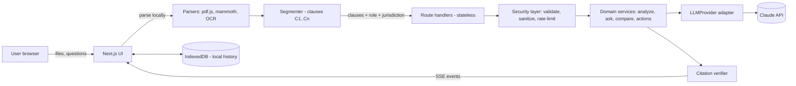
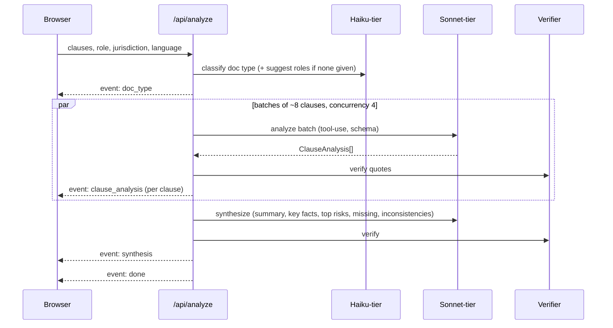

# architecture.md — LexLens System Architecture

## 1. Architectural principles

1. **Clause-first.** The clause is the atomic unit. Everything (analysis, Q&A, compare, actions) references clause IDs.
2. **Privacy by architecture.** Parse in the browser. Server is stateless. History lives in IndexedDB.
3. **Deterministic guards around probabilistic models.** Segmentation, diffing, citation verification and schema validation are code, not prompts.
4. **Stream everything.** Users see progress in seconds; partial results are first-class.
5. **Swap-able edges.** LLM, parser, storage and rate limiter sit behind interfaces.
6. **Pure core.** Domain logic in `core/` has zero framework dependencies and is unit-testable.

## 2. System context



## 3. Layers and dependency rule

```
app (routes, pages)  ─►  features (UI + hooks per capability)  ─►  core (pure domain)
        │                                                              ▲
        └────────────►  server (llm, security, http)  ────────────────┘
ui (design system, shaders) is imported by app & features only.
```

- `core/` imports **nothing** from `features/`, `ui/`, `server/`, `next/*`, `react`.
- `server/` may import `core/`. `features/` may import `core/` and `ui/`. `app/` composes.
- Enforce with ESLint `no-restricted-imports` (see `code-structure.md`).

## 4. Data model (Zod schemas in `core/domain`)

```ts
type ClauseId = `C${number}`;
type RiskLevel = "high" | "medium" | "low" | "info";
type Perspective = { role: string; description?: string };   // e.g. { role: "tenant" }

interface Clause {
  id: ClauseId; order: number; heading?: string; text: string;
  start: number; end: number;        // offsets into normalized document text
  page?: number; parentId?: ClauseId;
}

interface LegalDocument {
  id: string; name: string; hash: string; text: string; clauses: Clause[];
  docType?: DocType; language?: string; createdAt: string;
}

interface ClauseAnalysis {
  clauseId: ClauseId;
  canonicalType: ClauseType;                       // taxonomy in brain.md §4
  plainSummary: string;
  obligations: { party: string; action: string; deadline?: string }[];
  rights: string[];
  risk: { level: RiskLevel; reasons: string[]; favors: "you" | "other_party" | "balanced" | "unclear"; unusual: boolean };
  whyItMatters: string;
  questionsToAsk: string[];
  confidence: number;                              // 0..1, model self-report calibrated by evals
  citations: Citation[];
}

interface Citation { clauseId: ClauseId; quote: string; verified: boolean }

interface DocumentSynthesis {
  tldr: string;
  keyFacts: { label: string; value: string; citations: Citation[] }[];
  topRisks: { clauseId: ClauseId; headline: string }[];
  missingClauses: { type: ClauseType; why: string }[];
  inconsistencies: { description: string; citations: Citation[] }[];
}

interface Answer {
  text: string; citations: Citation[];
  basis: "document" | "general_information" | "not_found";
  confidence: number; followUps: string[]; escalation?: EscalationNotice;
}

interface ComparisonPair {
  a?: ClauseId; b?: ClauseId; type: ClauseType;
  status: "unchanged" | "modified" | "added" | "removed";
  wordDiff: DiffOp[];                              // deterministic
  whatChanged?: string; favorsNow?: "you" | "other_party" | "balanced" | "unclear";
  impactOnYou?: string; severity?: RiskLevel; citations: Citation[];
}
```

All LLM outputs are validated with the corresponding Zod schema; the same schema generates the JSON Schema passed to the model as a tool definition.

## 5. Pipelines

### 5.1 Ingest → Structure (client side)
1. `file → ArrayBuffer` → sniff MIME by magic bytes (not extension).
2. Parse: `pdfjs-dist` (text + page numbers), `mammoth` (DOCX → text/HTML), TXT/paste passthrough. OCR (`tesseract.js`) behind a feature flag.
3. **Normalize:** unify whitespace, fix hyphenation at line breaks, strip headers/footers repeated on ≥ 3 pages, keep page map.
4. **Segment (deterministic first):** regex/heuristics for `1.`, `1.1`, `(a)`, `Article I`, `Section 4`, ALL-CAPS headings; merge tiny fragments; split > 1,200-token clauses at sentence boundaries.
5. **LLM-assist segmentation (fallback):** if heuristics yield < 3 clauses on a > 2,000-word doc, ask Haiku-tier to propose boundaries; boundaries are validated as offsets (never rewritten text).
6. Assign IDs `C1…Cn`; compute content hash for caching and history.

### 5.2 Analyze (server, streamed)



### 5.3 Ask (grounded Q&A)
1. **Retrieve context:** if document ≤ ~60k tokens → send all clauses (cached prefix). Otherwise BM25 (MiniSearch) top-k + neighbour clauses + definitions clause.
2. **Escalation check:** cheap rule-based + Haiku classifier on the question (see `brain.md` §9).
3. **Answer:** Sonnet-tier with schema `Answer`. Must set `basis`.
4. **Verify:** each citation quote must be a normalized substring of the cited clause; unverified citations are dropped; if none remain and `basis = "document"` → downgrade to `not_found` or ask model to retry once.
5. Stream text tokens, then final structured payload.

### 5.4 Compare
1. Segment both docs.
2. **Tag** every clause with canonical type (reuse analysis if already done).
3. **Align:** group by `canonicalType`; within a group match by lexical similarity (token-set Jaccard + BM25) with a Hungarian-style greedy assignment; unmatched → added/removed. Ambiguous pairs (score 0.35–0.6) go to Haiku-tier to confirm.
4. **Diff:** word-level diff with `diff` (jsdiff) — deterministic.
5. **Explain:** Sonnet-tier per *modified* pair (batched): whatChanged, favorsNow (relative to the user's role), impactOnYou, severity.
6. **Summarize:** "3 changes that matter most" + missing/added clause summary.

### 5.5 Actions
`POST /api/actions` with `kind`: `checklist | lawyer_brief | options | simplify | translate | negotiate | glossary`. Inputs are the already-computed analysis (not raw text again) + optional user scenario → structured output → client renders / exports (print CSS → PDF, `.ics`).

## 6. API contract (all JSON unless noted; all validated with Zod)

| Method & path | Body | Response |
|---|---|---|
| `POST /api/analyze` | `{ clauses, role, jurisdiction?, language?, docNameHint? }` | **SSE** events: `doc_type`, `clause_analysis`, `synthesis`, `warning`, `done`, `error` |
| `POST /api/ask` | `{ question, clauses, analysisDigest?, history[≤6], role, jurisdiction? }` | **SSE**: `token`, `answer`, `error`, `done` |
| `POST /api/compare` | `{ a: {clauses, name}, b: {clauses, name}, role, mode: "versions"|"offers"|"policy_vs_template" }` | **SSE**: `aligned`, `pair_explained`, `summary`, `done`, `error` |
| `POST /api/actions` | `{ kind, analysis, scenario?, language? }` | JSON `ActionResult` |
| `GET /api/health` | — | `{ ok: true, version }` |

**Common headers:** `x-request-id` (generated), rate-limit headers. **Errors:** `{ error: { code, message, retryable } }` — codes in `server/http/errors.ts`.

**SSE format:** `event: <name>\ndata: <json>\n\n`, heartbeat comment every 15 s, client aborts via `AbortController`.

## 7. LLM integration

- `LLMProvider` interface: `generateObject<T>(schema, prompt, opts)` · `stream(prompt, opts)` · `countTokens(text)`.
- Adapter `AnthropicProvider` uses tool-use with forced `tool_choice` to get schema-shaped JSON; prompt caching on the document prefix; per-request timeout, exponential backoff with jitter (429/5xx/overloaded), circuit breaker.
- **Model tiers** via env: `LLM_MODEL_FAST` (classification, tiny tasks), `LLM_MODEL_MAIN` (analysis, Q&A, compare), `LLM_MODEL_DEEP` (optional "deep review"). Defaults documented in `tech-stack.md`.
- **Repair loop:** on schema failure → one automatic retry with the validation error appended; then degrade (return partial + `warning` event).
- **Budget guard:** max tokens per request, max clauses per request, per-IP daily cap.

## 8. Storage

| Data | Where | Notes |
|---|---|---|
| Documents, analyses, chats | **IndexedDB** (Dexie) | Optional AES-GCM encryption with a user passphrase (P2) |
| UI preferences (theme, language, perspective) | `localStorage` | No document content |
| Server cache | In-memory LRU keyed by `hash(promptPrefix)`; TTL ≤ 15 min | Never on disk; disabled in "private mode" |
| Demo mode fixtures | Static JSON in `public/demo/` | Synthetic docs only |

## 9. Error handling & resilience

- Every service returns `Result<T, AppError>`; route handlers map errors to HTTP + SSE `error`.
- Partial success is normal: failed batches yield `warning` events and skeleton "couldn't analyse this clause — retry" rows.
- Client retries idempotent calls once; user can retry per clause.
- Time budgets: route `maxDuration` set; server aborts LLM calls at 55 s.

## 10. Observability (privacy-safe)

- Structured JSON logs: `requestId, route, latencyMs, tokensIn, tokensOut, model, status, clauseCount`. **Never** document text, questions, or answers.
- Client debug panel (dev only) shows prompt version, timings, verifier stats.
- Eval harness (`pnpm eval`) is the primary quality signal.

## 11. Performance strategy

- Model tiering; batch clauses by token budget; parallel batches (concurrency 4).
- Prompt caching: identical document prefix across analyze/ask/compare calls.
- Virtualized clause list for > 100 clauses; shaders paused off-screen; DPR cap 1.5.
- Route-level code splitting; heavy libs (pdf.js, tesseract) dynamic-imported.

## 12. Deployment

- Vercel (Node runtime for route handlers; `maxDuration` 60). Env vars: see `tech-stack.md` §10.
- Alternative: Docker `node:alpine` + `next start` behind any reverse proxy (disable proxy buffering for SSE).
- Preview deployments for each PR; production deploy only from `main`.

## 13. Extensibility (post-hackathon)

Accounts + encrypted sync, curated jurisdiction knowledge packs (retrieval-backed with sources), lawyer hand-off (share Lawyer Brief link with expiry), browser extension for ToS pages, on-device small-model mode for maximum privacy.
